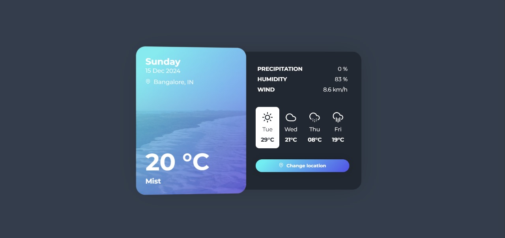

# Weathering App

A simple weather application that fetches weather data and displays it to the user. This project focuses on the basics of JavaScript and practicing essential concepts.

## Features
- Fetch weather data from an API
- Handle and display data dynamically
- Modular code structure for DOM manipulation, fetching data, and other operations

## Credits
The frontend design is based on the work by [Call_in](https://codepen.io/Call_in/pen/pMYGbZ). Full credit goes to them for the design.

## Learning Objectives
In this project, I learned to:
1. Fetch data and handle it appropriately
2. Structure code into separate files for DOM manipulation, data fetching, and other operations
3. Manage and handle data effectively

## Getting Started
To get started with this project, clone the repository and install the necessary dependencies.


```bash
git clone <your-repo-url>
cd weathering-app

```




